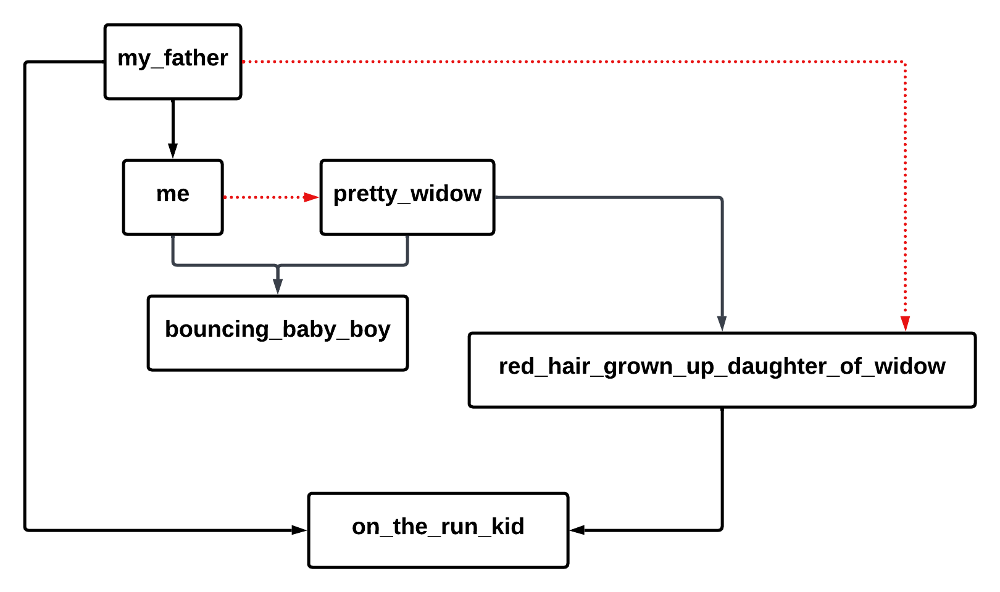

# Visual Representation of the lyrics

# Some hints for the project

- We need to maximize the number of rules and minimize the number of facts. If you observe carefully, we could just write a ton of facts to make a prolog version of the song. But we will be smart and write rules so that we can reduce the number of facts.

- We need to define the relationships using rules.

- We can use some of these rules,
  - `wife(X, Y)`: X is the wife of Y if husband(Y, X) returns true
  - `married(X, Y)`: This is true if either X is husband if Y or X is wife or Y
  - `parent(X, Y)`: If X is is either biological parent or step parent of Y
  - `parent_in_law(X, Z)`: If Y and Z are married and X is the parent of Y and X is not the parent of Z
  - `step_parent(X, Z)`: If X and Y are married and Y is the biological parent of Z and X is not the biological parent of Z 
  - `biological_parent(X, Y)`: If X is father or mother of Y
  - `grandparent(X, Z)`: If X is parent of Y and Y is parent of Z. Note that parent can be step or biological
  - `sibling(X, Y)`
  - `sibling_in_law(X, Y)`
  - `uncle_aunt(X, Z)`

- Use the symbol `\+` to denote `not true`. This will come in handy when you write the rules.