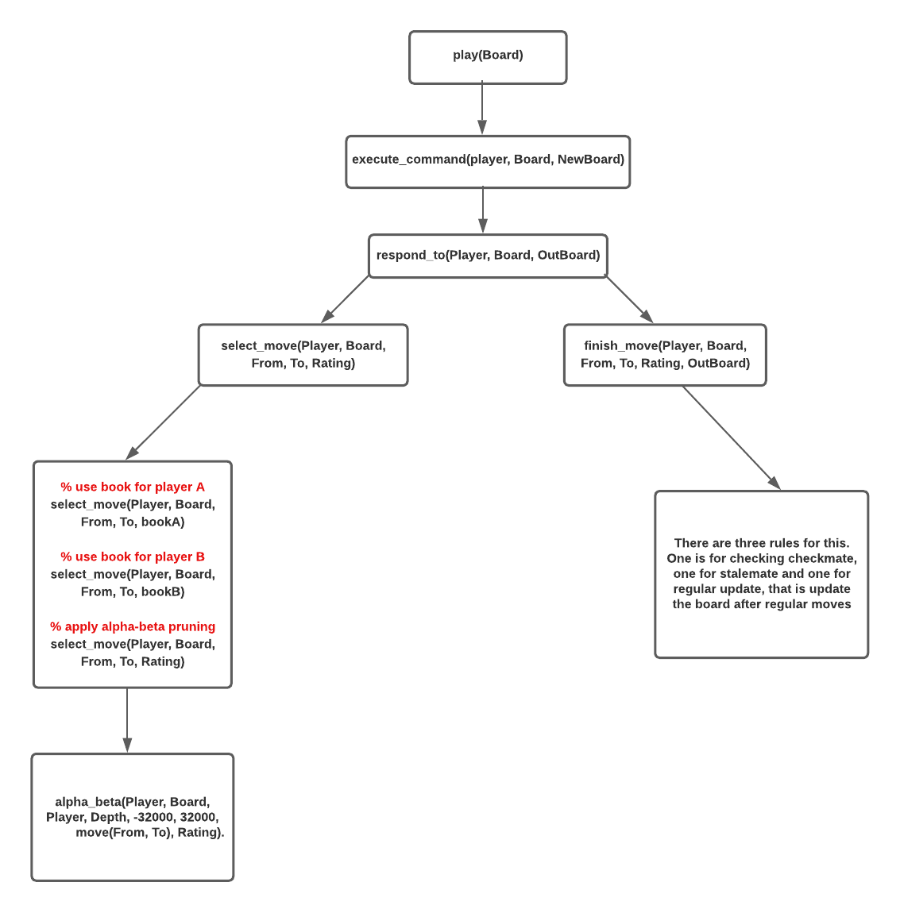

# Chess

## Task-1
### What do we have here?
We have the following piece of code for Task-1,
```prolog
% ------------------------------------------------------------------------------
% YOUR CODE STARTS HERE

% TASK 1: REPLACE THE print_board PREDICATE BELOW WITH YOUR CODE
print_board(Board) :-
    write(Board), nl.

% ------------------------------------------------------------------------------
% YOUR CODE ENDS HERE
```

### What do we need to do? 
- Currently, the code just writes the board state in the console. What we need is a visualization of the chess board. For this you can use [this code](./chess_task_1.pl).
- You need to print the board at the initialization. And after each of the moves. 
- What you can do is, replace the ` write(Board), nl.` in the rule `print_board(Board)` with any other rule to draw the board. Use the codes shown in the class.


## Task-3

### What do we have here?
So for Task-3, we are given the following piece of code. We have also been instructed where to change.

```prolog
% ------------------------------------------------------------------------------
% YOUR CODE STARTS HERE

% TASK 3: MODIFY THE CODE BELOW TO MAKE playerA and playerB auto-compete.
play(Board) :-
    get_command(Command),
    execute_command(Command, Board, NewBoard),
    execute_command(playerB, NewBoard, NextNewBoard),
    play(NextNewBoard).

get_command(Command) :-
    nl, write('white move -> '),
    read(Command), !.

execute_command(Move, Board, NewBoard) :-
         parse_move(Move, From, To),
         move(Board, From, To, white, Piece),
         make_move(Board, From, To, NewBoard), !.

execute_command(Player, Board, NewBoard) :-
    respond_to(Player, Board, NewBoard), !.

execute_command(X, Board, _) :-     % Use to catch unexpected situations
    write('What?'),
    halt(0).

% ------------------------------------------------------------------------------
% YOUR CODE ENDS HERE
```

### What is happening here?
- When `play(Board)` is being called, we are asking for the user to enter a move. This will be the move of the playerA aka the White. We are using `get_command(Command)` to fetch the input from the user and after that we are executing it.
- We have 3 `execute_command` rule here. 
  - The first one is for executing moves that are **given manually by the user**. 
  - The second one is for executing moves automatically. So, as we know that playerB's move has already been implemented, We are passing the player name here so that the move gets executed.
  - **The last one is to handle unexpected situation**. So that our code does not crash.

### What do we need to do? 
- For Task-3, we have been asked to modify the code so that playerA and playerB auto-competes.
- What we will do here is,
  - Stop calling the rule that gets the user input. 
  - When calling `execute_command` for playerA, instead of passing a variable like `Command`, **just pass the atom playerA**.
- Check out the code changes shown in the slides (recitation-8). **The red marked line is the required change.**

  

### Other notes
- Inside the `execute_command` we have called `respond_to`. There are two things inside. One selects the best move determined by the alpha beta pruning, and other finishes the move. By finish, we mean check whether the situation is checkmate or stalemate or if not any of these two, we update the board. But these are implemented.


## Task 2
Let's check out the code flow,



- `play(Board)` is called where we execute commands for playerA and playerB. `execute_command` is called from here. The second `execute_command` should be called.

- `execute_command` calls `respond_to` that eventually calls `select_move` and `finish_move`. The `select_move(Player, Board, From, To, Rating)` gets called.

- `select_move` will try setting the depth for alpha-beta pruning algorihtm. The AI works better when the depth is big. You will see something like `ply_depthB(Depth)`. You will find that there is `ply_depthA(Depth)` but there is no implementation for this. Implement that.

  There is `select_move(Player, Board, From, To, bookB)` where they use `bookB` inside. They have the similar thing for player A but there's no `bookA`. Write one observing `bookB`. They contain the initial boards and two extra variables, from and to. But if you look closely, the third ``select_move` gets called.

- After that, `alpha_beta` is called. 

- **Your job for the task-2 would be going through alpha_beta. Read the code carefully. You will find rules written specifically for the playerB. Such rules are called when it's playerBs' turn or we can say blacks turn. You will also find similar rules for playerA. The problem is they are only being called. They are not implemented yet. Your job is to check out the code for B and write them for A. You can learn more about the alpha-beta pruning algorithm in this [link](https://www.geeksforgeeks.org/minimax-algorithm-in-game-theory-set-4-alpha-beta-pruning/). But I thing writing codes for playerA mimicing playerB should work.**